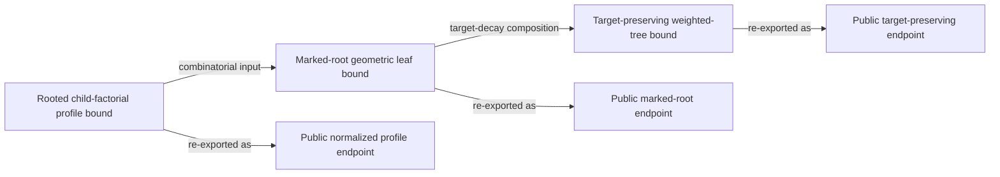

# Proof dependency graph

The public API is a deliberately small re-export layer over three theorem
endpoints in the pinned upstream development. The machine-readable graph is
[`archive/proof-dag.json`](https://github.com/lluiseriksson/lean-rooted-tree-polymer-expansion/blob/main/archive/proof-dag.json); its schema is
[`schemas/proof-dag.schema.json`](https://github.com/lluiseriksson/lean-rooted-tree-polymer-expansion/blob/main/schemas/proof-dag.schema.json).

The graph is audited for unique nodes, valid source blob identities, direct
re-export edges, agreement with the theorem manifest, and acyclicity. It is a
traceability aid, not an independent proof object: the Lean kernel build and
axiom oracle remain authoritative.
