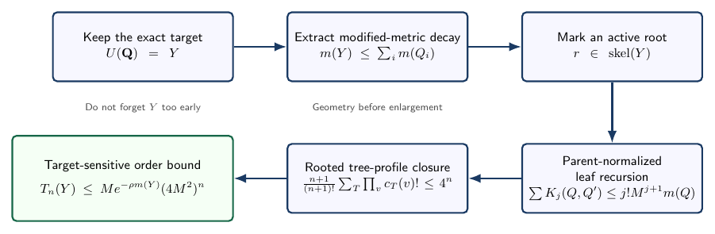

# Lean Rooted-Tree Polymer Expansion

**Machine-checked target-preserving Ursell leaf summation for polymer systems with holes.**

[Read the article](paper/index.md){ .md-button .md-button--primary }
[Read it as one page](generated/full-article.md){ .md-button }
[Inspect the Lean theorems](formalization/index.md){ .md-button }
[Verify the artifact](artifact/verification-contract.md){ .md-button }



<div class="grid cards" markdown>

-   **Integrated article**

    ---

    The manuscript, theorem map, references, and limitations are maintained in
    the same versioned documentation tree.

    [:octicons-arrow-right-24: Start reading](paper/index.md)

-   **Lean 4 companion**

    ---

    Three stable public theorem names re-export exact proofs from one immutable
    upstream revision.

    [:octicons-arrow-right-24: Formalization map](formalization/index.md)

-   **Auditable claims boundary**

    ---

    The site separates what the kernel checks from model-specific and continuum
    statements outside the artifact.

    [:octicons-arrow-right-24: Claims and scope](about/claims.md)

-   **Release evidence**

    ---

    Deterministic ZIP generation, clean-room extraction, SHA-256 sidecars, two
    SBOM formats, build information, and provenance attestations support review.

    [:octicons-arrow-right-24: Inspect the evidence](artifact/release-evidence.md)

</div>

## Result at a glance

For complete-graph spanning trees on `n+1` labelled vertices, rooted at `0`,
with rooted child counts $c_T(v)$,

$$
\frac{n+1}{(n+1)!}
\sum_T \prod_v c_T(v)! \le 4^n.
$$

Let $M$ be the rooted hard-core metric-moment constant and define $L=4M^2$.
The marked-root leaf sum obeys

$$
(n+1)S_n(r)\le M L^n,
$$

and preserving the exact target union until decay is extracted gives

$$
T_n(Y)\le M e^{-\rho m(Y)}L^n.
$$

## Public theorem interface

```lean
MarkedRootedClosure.normalizedRootedChildFactorialTreeBound
MarkedRootedClosure.markedRootLeafGeometricBound
MarkedRootedClosure.targetPreservingWeightedTreeBound
```

Each alias is an exact application of a theorem in the pinned upstream proof
development. See the [endpoint table](formalization/index.md) and the
[machine-readable theorem map](artifact/theorem-map.md).

## Trust boundary

This repository proves finite combinatorics and target-sensitive geometric
composition. It does not prove a model-specific raw Yang--Mills activity,
`hRpoly`, a continuum limit, reconstruction, or a mass gap. That distinction is
part of the artifact: see [Claims and scope](about/claims.md).

## Stable public identity

The repository and Pages URL now use the descriptive slug
`lean-rooted-tree-polymer-expansion`. The Lean package remains
`MarkedRootedClosure` so downstream imports and theorem references stay stable.
See [Repository identity history](maintainers/repository-history.md).
